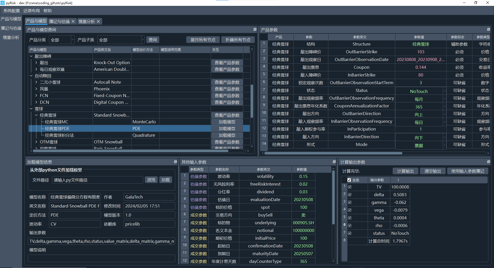
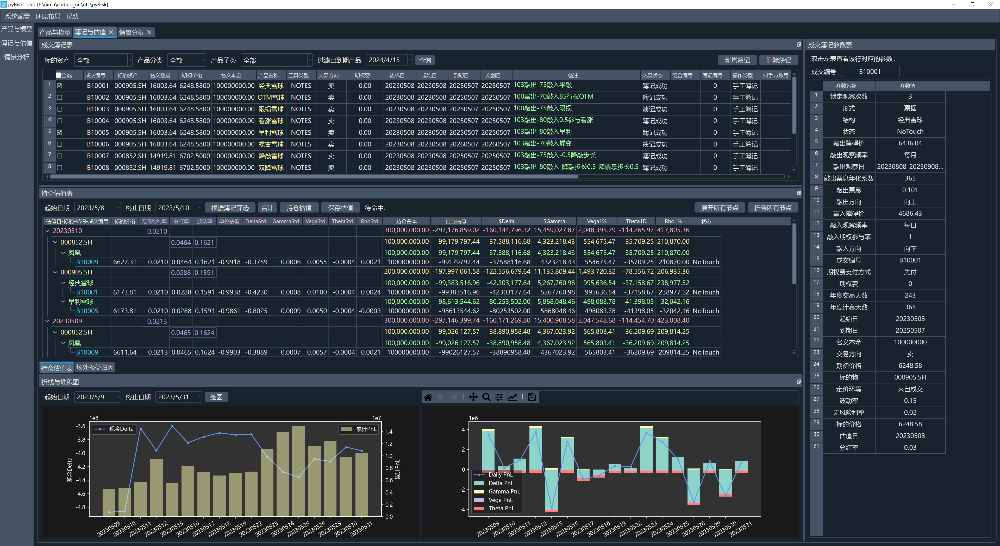

# 开源场外衍生品定价库pricelib

## 1. 项目简介

本项目是一个使用Python语言编写的开源金融衍生品定价库，包含多种定价方法，涵盖了国内场外衍生品市场主流的权益类衍生品结构。定价方法方面，本定价库支持解析解、Monte Carlo模拟法、PDE有限差分法、数值积分法以及树方法；波动率模型方面，本定价库支持常数波动率模型、局部波动率模型、Heston随机波动率模型。

基于国内场外衍生品市场发展的现状，市场对自动赎回结构(Autocallable)，尤其是各种类型的雪球、凤凰结构的定价有更大的需求。本定价库立足于国内市场需求，支持多种雪球变种和凤凰结构的定价，具体如下：

| **产品分类**     | **产品子类**                        | **模型**                                                           |
|--------------|---------------------------------|------------------------------------------------------------------|
| **1 香草及其组合** | 欧式，价差，跨式，宽跨式，折价，领口，风险逆转         | Black Scholes Merton解析解，蒙特卡洛模拟，PDE，积分法，二叉树                       |
|              | 美式期权                            | BAW(1987)近似解、Bjerksund Stensland(2002)近似解、LSMC、PDE、积分法、二叉树       |
| **2 亚式期权**   | 亚式期权-平均执行价/平均收盘价，几何平均/算术平均      | Kemma Vorst(1990)几何平均收盘价亚式解析解，算术平均收盘价二叉树，蒙特卡洛模拟                  |
|              | 增强亚式                            | 蒙特卡洛模拟                                                           |
| **3 二元及其组合** | 欧式二元，美式二元，一触即付                  | Reiner Rubinstein(1991b)解析解，蒙特卡洛模拟，PDE，二叉树，积分法                   |
|              | 二元凸式，二元凹式，美式双接触，美式双不接触          | Hui(1996)美式双接触/双不接触解析解，蒙特卡洛模拟，PDE                                |
| **4 障碍期权**   | 单鲨(敲出期权)，敲入期权                   | Reiner Rubinstein(1991a)单边障碍解析解，蒙特卡洛模拟，PDE，二叉树，积分法 |
|              | 双边障碍，双鲨                         | Ikeda Kunitomo(1992)双边障碍级数解，Haug(1998)双边障碍近似解，蒙特卡洛模拟，PDE         |
|              | 安全气囊                            | 解析解(障碍与二元组合)，蒙特卡洛模拟，PDE                                          |
| **5 自动赎回结构** | 无敲入的自动赎回：二元小雪球                  | 蒙特卡洛模拟，PDE，积分法                                                   |
|              | 定期派息票据：FCN、DCN、凤凰               | 蒙特卡洛模拟，PDE，积分法                                                   |
|              | 雪球结构：平敲、降敲、早利、蝶变、双降、限损、OTM、看涨雪球 | 蒙特卡洛模拟，PDE，积分法                                                   |
|              | 雪球变种：巴黎雪球                       |蒙特卡洛模拟 |
| **6 累计期权**   | 标准累购，标准累沽，区间累计                  | 蒙特卡洛模拟                                                           |
>注：二元期权和障碍期权的解析解，都可以选择Broadie Glasserman Kou(1995)离散观察修正，既支持连续观察，也支持离散观察。

具体的产品及其参数的介绍，在场外百科微信小程序中，已经整理成了结构百科，可以方便地查阅。
<div align=center>

<br>


</div>

我们会持续关注市场上的最新动态，迅速地在priceLib中更新流行产品的定价模型。如果您有特别的产品定价需求，也可以与我们联系，我们通常可以在两至三天更新至priceLib中。您可以通过gitee社区与我们互动，或通过下方电话、邮件联系我们，也欢迎大家扫描下方二维码关注凌瓴科技微信公众号。

- 电话：021-50186069
- 邮箱：marx@galatech.com.cn
- 微信公众号：凌瓴科技
<div align=center>

</div>

## 2. 安装方法
1. 如果您只想调用pricelib实现定价，在您的终端中使用命令`pip install pricelib`即可将pricelib安装到Python解释器的`Lib/site-packages`中。

2. 如果您是开发者并且想要在本地安装这个Python库，您需要在https://gitee.com/lltech/pricelib下载项目的源码，然后在项目的根目录下，用终端运行`pip install -e .`命令，这个目录应该包含`setup.py`文件。这个命令将以"editable"模式安装这个库，这意味着您对源代码的任何修改都会立即反映到您的环境中，无需重新安装。

3. 如果您还想安装绘图依赖项和开发依赖项（在`setup.py`文件的`extras_require`中定义，绘图依赖项包括`matplotlib`和`plotly`，开发依赖项包括静态分析工具`flake8`、`pylint`和测试工具`pytest`），您应该在终端中使用`pip install -e .[dev,plot]`命令， 这将安装pricelib库、绘图依赖项和开发依赖项。   
如果您只想安装pricelib库和开发依赖项，则您应该使用`pip install -e .[dev]`命令。

## 3. 使用教程

### 3.1 快速上手: 使用默认的BSM模型，快速实现定价

只需三行代码，创建`定价引擎`和`产品结构`，然后调用`price`方法，即可完成定价。 以美式期权为例：
```python
from pricelib import *
# 1. 创建BAW近似解定价引擎，输入s、r、q、vol参数，此时会直接使用默认的BSM模型
engine = AnalyticVanillaAmEngine(s=100, r=0.02, q=0.01, vol=0.2, an_method="BAW")
# 2. 创建产品结构
option = VanillaOption(strike=100, maturity=1, callput=CallPut.Call,
                       exercise_type=ExerciseType.American, engine=engine)
# 3. 完成定价
print(option.price())  
```
同一个产品对象可以切换不同的定价引擎，将上面的美式期权改为PDE有限差分法进行定价：
```python
# 创建PDE有限差分法定价引擎，输入s、r、q、vol参数，此时会直接使用默认的BSM模型
fdm_engine = FdmVanillaEngine(s=100, r=0.02, q=0.01, vol=0.2)
# 为产品对象切换定价引擎
option.set_pricing_engine(fdm_engine)
print(option.price())  
```
再比如较为复杂的雪球结构，"敲出票息10%的一年期锁三103-80平敲雪球"，一样只需三行代码即可完成定价：

```python
from pricelib import *
pde_engine = FdmSnowBallEngine(s=100, r=0.02, q=0.01, vol=0.16, s_step=200, n_smax=2)
option = StandardSnowball(maturity=1, lock_term=3, s0=100, barrier_out=103, barrier_in=80,
                          coupon_out=0.10, engine=pde_engine)
print(option.price())  
```
这里的`s0=100, barrier_out=103, barrier_in=80`的价格是百分比形式，您也可以输入价格的绝对值，例如`s0=5535.40, barrier_out=5701.46, barrier_in=4428.32`，只要所有价格参数保持一致即可。

调用产品对象的`delta, gamma, vega, theta, rho`方法，即可计算常见的5种期权希腊值：
```python
print({"delta": option.delta(), "gamma": option.gamma(), "vega": option.vega(),
       "theta": option.theta(), "rho": option.rho()})
```
如果您想一次性计算期权估值和5种希腊值，可以调用产品对象的`pv_and_greeks`方法：
```python
pv, delta, gamma, vega, theta, rho = option.pv_and_greeks()
```
对于雪球结构的PDE定价引擎，您可以获取有限差分的price、delta和gamma网格，进行绘图：
```python
from pricelib.common.utilities import pde_plot
# 绘制delta和gamma曲面图
delta_matrix, s_vec = pde_engine.delta_matrix(status=StatusType.NoTouch)
fig1 = pde_plot.draw_greeks_surface("delta", delta_matrix, 
                                    spot_range=(65, 115), show_plot=True)
gamma_matrix, s_vec = pde_engine.gamma_matrix(status=StatusType.NoTouch)
fig2 = pde_plot.draw_greeks_surface("gamma", gamma_matrix, show_plot=True)
# 绘制t=0时的delta和gamma曲线
fig3 = pde_plot.draw_greeks_curve(delta_matrix, gamma_matrix, t=0, 
                                  spot_range=(65, 115), show_plot=True)
```

### 3.2 进阶使用: 为产品结构自行配置随机过程和定价引擎
 
除了使用默认的BSM模型之外，您也可以自行为产品结构配置所需的随机过程和定价引擎。

本定价库搭建了一个统一的框架：定价引擎、随机过程和波动率模型使用策略模式
* 产品对象可以随时切换不同的定价引擎
* 定价引擎可以设置不同种类的随机过程
* 随机过程可以对应不同的波动率模型

本框架不仅易于使用，而且方便扩展新的产品和定价方法。

以香草期权为例，首先创建标的价格spot、无风险利率r、分红率q、波动率vol等估值参数对象。
```python
from pricelib import *
# 1. 市场数据，Observable被观察者
riskfree = SimpleQuote(value=0.02, name="无风险利率")
dividend = SimpleQuote(value=0.05, name="中证1000贴水率")
volatility = BlackConstVol(0.16, name="中证1000波动率")
spot_price = SimpleQuote(value=100, name="中证1000指数")
# 常数波动率
process = GeneralizedBSMProcess(spot=spot_price, interest=riskfree, 
                                div=dividend, vol=volatility)
```
其中r、q、vol可以设为常数，也可以设为期限结构、局部波动率。
```python
import pandas as pd
# 从csv文件中读取数据
div = pd.read_csv("./tests/div.csv")
loc_vol_df = pd.read_csv("./tests/loc_vol.csv", index_col=0)
expirations = loc_vol_df.index.values
strikes = loc_vol_df.columns.values.astype(float)
volval = loc_vol_df.values
# q期限结构
dividend = RateTermStructure.from_array(div['maturity'].values, div['q'].values)
# 局部波动率
volatility = LocalVolSurface(expirations=expirations, strikes=strikes, volval=volval)
```
然后，实例化一个随机过程，可以选择广义BSM过程或Heston过程，其属性包括上述spot、r、q、vol等估值参数。  
随机过程是Observer观察者，在估值参数改变时会收到通知。  
根据不同的r和q值，广义BSM过程可以变为: 
* 1973年Black-Scholes无股利股票期权模型
* 1973年Merton连续股利股票期权模型
* 1976年Black期货期权模型
* 1983年Garman-Kohlhagen外汇期权定价模型。
```python
# 2. 随机过程
# BSM动态过程：常数波动率 or 局部波动率
process = GeneralizedBSMProcess(spot=spot_price, interest=riskfree,
                                div=dividend, vol=volatility)
# Heston动态过程
process = HestonProcess(spot=spot_price, interest=riskfree, div=dividend, v0=0.025,
                        var_theta=0.02, var_kappa=4.01, var_vol=0.1, var_rho=-0.3)
```
接着，实例化一个定价引擎，定价引擎可以选择解析解、蒙特卡洛模拟、PDE有限差分法、数值积分法、树方法，  
其属性包含一个随机过程，以及定价方法参数，例如：
* Monte Carlo的路径数、随机数种类、方差缩减选项、低差异序列选项、随机数种子
* PDE有限差分的价格格点数、最大价格边界、有限差分算法(显式/隐式/Crank-Nicolson)
* 积分法的数值积分方法(梯形法则/辛普森法则)、价格格点数、最大价格边界
* 树方法的树分支数
```python
# 3. 定价引擎
an_engine = AnalyticVanillaEuEngine(process)
mc_engine = MCVanillaEngine(process, n_path=100000, rands_method=RandsMethod.LowDiscrepancy,
                            antithetic_variate=True, ld_method=LdMethod.Sobol, seed=0)
quad_engine = QuadVanillaEngine(process, quad_method=QuadMethod.Simpson,
                                n_points=801, n_max=4)
bitree_engine = BiTreeVanillaEngine(process, tree_branches=500)
pde_engine = FdmVanillaEngine(process, s_step=400, n_smax=4, fdm_theta=0.5)
```
最后，实例化一个期权产品对象，其属性包括一个定价引擎，以及产品参数，以香草期权为例，产品参数为看涨看跌、行权方式、行权价和到期时间。
```python
# 4. 定义产品：香草欧式期权
option = VanillaOption(maturity=1, strike=100, callput=Callput.Call,
                       exercise_type=ExerciseType.European)
# 使用Monte Carlo模拟定价
option.set_pricing_engine(mc_engine)
price_mc = option.price()
# 使用有限差分法定价
option.set_pricing_engine(pde_engine)
price_pde = option.price()
```
调用期权产品的price()方法，即可实现定价。各个衍生品结构的不同定价方法的使用示例，详见https://gitee.com/lltech/pricelib的examples。

定价引擎支持的波动率模型具体如下:

| **定价引擎**        | **波动率模型**               |
|-----------------|-------------------------|
| 1 解析解           | 常数波动率                   |
| 2 Monte Carlo模拟 | 常数波动率、局部波动率、Heston随机波动率 |
| 3 PDE有限差分法      | 常数波动率、局部波动率             |
| 4 积分法           | 常数波动率                   |
| 5 树方法           | 常数波动率                   |

### 3.3 时间参数的输入—— 只输入期限 / 输入起止日期

在上面的例子中，产品的到期时间直接输入了`maturity = 1`年:
```python
option = VanillaOption(maturity=1, strike=100, callput=Callput.Call,
                       exercise_type=ExerciseType.European)
```
但是，有时候我们需要输入起止日期，这时候可以使用以下方式：
```python
import datetime
start_date= datetime.date(2022, 1, 5)
end_date = datetime.date(2023, 1, 5)
option = VanillaOption(start_date=start_date, end_date=end_date, strike=100, 
                       callput=Callput.Call, exercise_type=ExerciseType.European)
```
需要注意的是，采用设置起止日期的方法时，一般需要指定估值日期，否则估值日期默认为今天的日期：
```python
set_evaluation_date(datetime.date(2022, 1, 5))
print(option.price())
```
在仅输入`maturity = 1`年时，实际上将起始日期设置为了估值日期，结束日期设置为了估值日期延后1年。  
如果您需要更精细地处理交易日历和年化系数，可以在产品对象中设置相关参数：
```python
option = VanillaOption(strike=100, callput=Callput.Call, exercise_type=ExerciseType.European,
                       start_date=start_date, end_date=end_date, trade_calendar=CN_CALENDAR, 
                       annual_days=annual_days, t_step_per_year=t_step_per_year)
set_evaluation_date(datetime.date(2022, 1, 5))
```
其中：
* trade_calendar：交易日历，默认使用中国内地的交易日历。
* annual_days：每年的自然日数量，默认为365天。
* t_step_per_year：每年的交易日数量，默认为243天。

对于一些结构复杂的衍生品，例如雪球、凤凰等自动赎回结构，涉及到敲出观察日。  
正如前面举过的例子，您可以不输入敲出观察日，仅输入存续期`maturity = 1`年和锁定期`lock_term = 3`个月，  
此时产品对象会自动生成一个根据交易日历调整后的敲出观察日期序列：
```python
option = StandardSnowball(maturity=1, lock_term=3, s0=100, barrier_out=103, barrier_in=80,
                          coupon_out=0.10, coupon_div=0.05)
```
这是一个"敲出票息10%，红利票息5%的1年期锁三103-80平敲雪球"，由于敲出观察日缺省，在定价过程中，程序会自动生成如下的敲出观察日序列（假设估值日期设为2022年1月5日）：
```
20220406_20220505_20220606_20220705_20220805_20220905_20221010_20221107_20221205_20230105
```
可以注意到自动生成的日期序列是每个月的工作日，遇到周六周日和法定节假日会向后顺延（如果顺延后月份变化，则会向前调整）。

另一种方式是直接输入敲出观察日序列，同时到期时间改为输入起止日期：
```python
from datetime import date
start_date= date(2022, 1, 5)
end_date = date(2023, 1, 5)
obs_dates = [date(2022, 4, 6), date(2022, 5, 5), date(2022, 6, 6), date(2022, 7, 5),
             date(2022, 8, 5), date(2022, 9, 5),date(2022, 10, 10), date(2022, 11, 7),
             date(2022, 12, 5), date(2023, 1, 5)]

option = StandardSnowball(start_date=start_date, end_date=end_date, obs_dates=obs_dates,
                          lock_term=3, s0=100, barrier_out=103, barrier_in=80,
                          coupon_out=0.10, coupon_div=0.05)

set_evaluation_date(date(2022, 1, 5))
print(option.price())
```
这里使用的是默认的CN_CALENDAR(中国内地交易日历)，年化系数为365和243，如果需要更改，可以在产品对象中设置相关参数。

### 3.4 注意事项

如果您在运行过定价库的代码之后，移动了定价库的位置，或者更改了定价库内文件夹的名称，这时候可能会出现报错。

这个问题产生的原因是定价库中使用了numba的JIT(Just in Time)即时编译技术进行加速，
并且开启了`cache=True`，这样会将编译好的中间代码缓存到本地，以提高下次运行的速度。如果您移动了定价库的位置，缓存的中间代码没有更新，于是就会引发报错。

遇到这种问题时，只需要在定价库目录搜索所有的`__pycache__`文件夹，删除其中的所有文件，然后重新运行代码即可。

## 4. 优势与应用
### 4.1 项目的优点

在此之前，虽然有很多衍生品开源定价库，实际上具有最大影响力的仍然首推QuantLib。QuantLib有很多优点：

* 强大的设计：整个库的结构设计、可扩展性很强，是一个非常优秀的C++项目。
* 丰富的功能：支持各种金融计算和定价方法的实现。它提供了多种定价模型、数值优化方法和风险度量方法，可以满足不同用户的需求。
* 稳定和可靠：使用高质量的数值算法，确保计算结果的准确性和稳定性，经过广泛的测试和验证，是一个稳定和可靠的库。

QuantLib也有一些缺点：

* 学习曲线陡峭：学习和使用QuantLib很大的一个障碍就是其开发语言为C++，而很多金融从业者使用的是python。虽然QuantLib提供了Python封装，通过SWING技术封装后可以在Python调用，但是底层模型实现毕竟是C++，理解C++代码还是有一定的困难的。并且，QuantLib的参考文档不够丰富，即使直接阅读源代码，其中的注释也很有限。
* 不适应国内的情况：QuantLib主要针对的是国际市场，国内的一些金融产品不够丰富，例如雪球、凤凰等含有自动赎回结构的国内主流的场外衍生品，QuantLib并不支持。
* 不方便扩展：由于python版本的QuantLib使用swig进行了封装，如果出现了新产品、新模型，需要更新、调试或跟踪QuantLib的底层C++实现，极其的不方便。
* 非线程安全：QuantLib是非线程安全的，在多线程中使用的时候，可能会造成不可描述的错误。

我们借鉴了QuantLib的框架，完全使用Python编写了pricelib定价库，结构清晰，源码简单易懂，适合只有Python基础的金融从业者上手使用，可以在业务上出现新产品时迅速二次开发，扩展新的产品和配套的定价引擎。

pricelib有以下优点：

* 使用方便简单，只需三行代码即可完成定价。如果想要修改默认的参数和随机过程，也有丰富的选项可供用户自行配置。PriceLib的代码注释、使用示例非常详细，便于学习上手使用。
* 完全采用Python语言，并且考虑了用户的代码经验各不相同的现实，对代码进行简化，没有过多采用繁复的写法，整体符合Pythonic的风格：用Python的方式写出简洁优美的代码；
* 产品为中国市场上流行的结构化产品，如香草、二元、亚式、鲨鱼鳍、雪球、凤凰等，基本覆盖了常见的结构。对一些产品进行了重点的优化，例如雪球，对期进行了细化和分类，支持多种雪球变种的定价。
* 模型覆盖面广。除了常见的解析解和Monte Carlo模拟法以外，还提供了PDE有限差分法、数值积分法、二叉树等各种例子，支持局部波动率和Heston随机波动率，可供参考。
* 单个产品的定价模型文件可以单独进行版本管理。面对市场的新结构、新需求，业务部门可以迅速在老模型的基础上改写，然而风控部门在面对扩展新模型时，需要避免影响定价库中其他模型的定价结果。pricelib采用模块化松耦合的设计，扩展新产品、新模型不影响公共组件，便于进行版本管理。
* 较高的计算速度。期权定价涉及大量数值计算，对计算效率有一定要求。相对于常规python定价代码，本定价库具有较高的计算速度，使用了以下方法提高计算效率：
  * numpy向量化计算；
  * JIT(Just in Time)即时编译技术；
  * 最近最少使用缓存lru_cache(Last recently used cache)；
  * 对于Monte Carlo模拟法，支持方差缩减方法和低差异序列，加快收敛速度，减少需要的模拟路径数；支持复用已有的随机数矩阵和价格路径；
  * 对于PDE有限差分法，由于需要求解的线性方程组的系数矩阵都是三对角矩阵，本定价库使用Thomas算法(the Tridiagonal Matrix Algorithm)提高求解效率，本方法比矩阵求逆或LU分解更快。

### 4.2 目前的局限
当前库中暂未把资金交易作为重点，例如，在发行雪球时，在各个时点与对手方进行现金和利息的收付，后续我们会视情况增加。此外，我们目前聚焦于权益类衍生品，利率、汇率、商品等其他品种会在后续逐步扩展。

### 4.3 一些应用
由于Python语言是出名的胶水语言，和C/C++、Java等工业界常用的开发语言可以很好的融合，当然也可以使用Flask直接封装成服务。总之，基于pricelib定价库，可以开发多种场外业务系统，包括但不限于：
* 估值系统: 加上参数管理模块，再调用定价模型，即可进行估值。
* 风险监控系统: 盈亏分解、参数敏感性分析、压力测试报表等。
* 自动对冲交易系统: 由于定价库中提供了PDE等方法，可以支持实时的持仓和Greeks监控，因此可以开发交易系统进行雪球等产品的自动化对冲。

由于pricelib是开源的，也可以直接对结构和模型进行扩展。

pricelib作为一个定价库，没有界面，不太直观，因此在推出开源的pricelib的同时，我们推出了pyRisk这个小工具作为展示定价引擎的窗口。pyRisk具有以下功能：

* 产品与模型管理：根据产品收录和管理对应的模型，同一产品下的模型遵照统一的产品参数，模型根据定价方法具有自己的方法参数，成交参数与估值参数字段统一，全模型通用。
* 簿记：通过可扩展的设计，避免了现在很多场外MIS系统经常发生的“记不进去”的困难。即使业务中出现新结构、新参数，也可以方便地簿记进来。
* 估值：支持日终估值与损益归因，可以按照估值日-标的资产-结构种类分组汇总统计，并绘制盈亏折线图与损益归因堆积图。
* 其他常用工具：如Greeks敏感性分析，S-σ压力测试等。






pyRisk的定位是个小巧的辅助工具，主要目的只是为了展示应用pricelib的经典场景。如果您想试用pyRisk，可以联系我们免费获取。

## 5. 项目结构

```
├─examples 使用示例                   
├─pricelib 金融衍生品定价库
│  ├─common  公共类和函数
│  │  ├─product_base 产品基类
│  │  ├─pricing_engine_base 定价引擎基类
│  │  ├─processes 随机过程
│  │  ├─term_structures 期限结构
│  │  ├─volmodels 波动率模型
│  │  ├─time 日期处理
│  │  └─utilities 工具函数
│  ├─products 产品
│  │  ├─vanilla 香草期权
│  │  ├─asian 亚式期权
│  │  ├─digital 二元期权
│  │  ├─barrier 障碍期权
│  │  ├─autocallable 自动赎回
│  │  └─accurals 累计期权
│  └─pricing_engines 定价引擎
│     ├─analyticalengines 解析解
│     ├─fdmengines PDE有限差分法
│     ├─integralengines 数值积分法
│     ├─mcengines 蒙特卡洛模拟
│     └─treeengines 树方法
├─tests 测试
├─setup.py 安装配置文件
├─.flake8 静态代码检查配置文件
├─.pylintrc 静态代码检查配置文件
├─LICENSE 许可证文件
├─NOTICE 项目许可
└─README.md 说明文档
```

## 6. 项目依赖

使用的Python解释器版本及第三方库详见setup.py文件

## 7. 静态代码检查与单元测试

本项目使用`flake8`和`pylint`进行静态代码检查，使用`pytest`进行单元测试
* 在项目根目录下执行以下命令进行静态代码检查：`flake8 pricelib`，`pylint pricelib`
* 在项目根目录下执行以下命令进行单元测试：`pytest`

## 8. 项目许可

pricelib is an open-source financial derivatives pricing library written in Python.

This file is part of pricelib.

Copyright (C) 2024 Galaxy Technologies

Licensed under the Apache License, Version 2.0 (the "License");
you may not use pricelib except in compliance with the License.
You may obtain a copy of the License at

    http://www.apache.org/licenses/LICENSE-2.0

Unless required by applicable law or agreed to in writing, software
distributed under the License is distributed on an "AS IS" BASIS,
WITHOUT WARRANTIES OR CONDITIONS OF ANY KIND, either express or implied.
See the License for the specific language governing permissions and
limitations under the License.

## 9. 特别鸣谢

在长期的默默地准备中，来自上海财经大学的多位实习生做出了重要的贡献。在这里我们要大声地感谢他们：夏鸿翔、张鹏任、张峻尉、刘振伟、裴子涵，谢谢你们！也让我们感谢上海财经大学培养了这么多优秀的学生，为金融强国贡献了力量！


